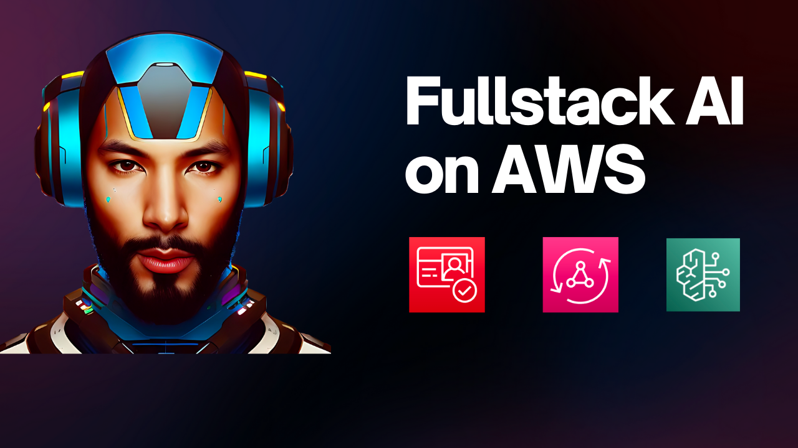

# Fullstack AI on AWS


👉 https://youtu.be/EEhgiHnnHXg 👈

If you've ever wanted to complete guide to building your next application on AWS, this is the repo for you.

> 🗒️ This repo is part of a YouTube video that describes how each of the various pieces are built and deployed.

## Overview

This repo brings together [core AWS services that every app needs](https://youtube.com/shorts/DfwhE6yXcCM?si=ds2hBN2Ia2pIfdC3):

- [Amazon Cognito](https://aws.amazon.com/cognito/): Allows user signups, forgot password, and more
- [AWS AppSync](https://aws.amazon.com/appsync/): A managed GraphQL service that provides websockets out of the box
- [Amazon DynamoDB](https://aws.amazon.com/dynamodb/): Database layer
- [Amazon Bedrock](https://aws.amazon.com/bedrock/): AI LLM service

All of these services are located in their own folder in the `backend` directory. They then come together in the `lib/backendStack.ts` file.

In addition, this comes with a frontend that uses [NextJS](https://nextjs.org/), [Tailwind CSS](https://tailwindcss.com/), [DaisyUI](https://daisyui.com/), and [Amplify Libraries](https://docs.amplify.aws/).

This is completely built with TypeScript on both the NextJS side and the AWS CDK side.

Checkout my YouTube channel for more content like this!

## Note

This project expects a file called `aws-exports.ts`. The Youtube video shows how to create this but essentially the following fields would need to be populated:

```ts
export const config = {
	aws_project_region: '',
	Auth: {
		region: '',
		userPoolId: '',
		userPoolWebClientId: '',
		identityPoolId: '',
	},
	aws_appsync_graphqlEndpoint: '',
	aws_appsync_region: '',
	aws_appsync_authenticationType: '',
}
```
